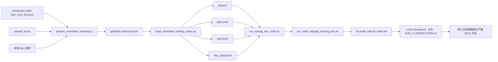

# OmniOPSD 项目代码讲解

本文面向第一次阅读 `/share/home/ylhu/Omni-OPSD/OmniOPSD_training_code_20260907` 的研究者，解释这个项目为什么存在、数据怎样流动、四种训练方法怎样被编码，以及每个核心脚本在整个流程中的位置。本文以当前项目中的 OmniVideo-100K Gap5000 数据流程为主，同时说明 `temporal/` 和旧 VideoOdyssey 入口为什么会出现在同一个代码包里。

阅读时可以先记住一条主线：



这里的“学生”是正在更新的 Qwen2.5-Omni-7B LoRA 模型。“教师”是 OPSD/GKD 过程中用于提供 token 分布或 log-probability 的模型视图。需要特别区分两层含义：四组矩阵都复制一份相同的“学生侧/共同用户输入”，只是为了公平比较；这不表示 SFT 和 GRPO 也各自有一个 teacher。SFT 是普通的答案监督（assistant target），GRPO 是外部奖励监督（`solution`）；只有 OPSD 和 CLUE-OPSD 才真正启用 teacher 视图和蒸馏过程。四组数据的学生输入必须相同，只有答案所在的位置和教师看到的内容不同；这是项目进行公平比较的核心约束。

## 1. 项目边界和目录结构

这个目录是一个训练代码包，不是一个包含所有资源的完整模型发布包。`BUNDLE_MANIFEST.json` 记录了打包时的来源提交和文件清单，并明确排除了数据集、原始视频、模型权重、检查点、日志、缓存和 Python 环境。当前工作区后来生成的 `data/gap5000/` 是本机实验产物，不能假设在另一台机器上也存在。

还要区分“代码可以启动”和“研究结论可以发表”这两个层次。上级项目的 `docs/PROJECT_README.md` 记录了正式 OPSD/LoRA 训练的阶段门槛；时间证据和 A0–A5 原子研究尚未全部完成前，长跑结果不应被自动解释为论文级复现。本文解释代码怎样工作，不替代上级项目的实验计划、数据许可和结果审查。

主要目录可以这样理解：

| 路径 | 作用 |
| --- | --- |
| `src/omni_opsd/data/` | 数据适配器、规范化 schema、证据区间和 ms-swift 行格式 |
| `src/omni_opsd/temporal/` | 与框架无关的时间证据、视图、教师聚合、统计和 bootstrap 工具 |
| `src/omni_opsd/rewards.py`、`evaluation.py`、`losses.py` | MCQ 奖励、严格评估和纯 PyTorch 蒸馏损失工具 |
| `scripts/` | 可执行的数据准备、矩阵构建、训练启动、评估和环境检查脚本 |
| `patches/` | ms-swift rollout 协议和 qwen-omni-utils 的兼容补丁；历史补丁也保留在这里 |
| `tests/` | 不加载大模型即可运行的数据契约、奖励、评估、媒体辅助和启动器测试 |
| `data/gap5000/` | 当前 5000 条实验的规范化数据、四组矩阵和审计文件 |
| `ms-swift/`、`third_party/ms-swift/` | 外部 ms-swift 的两个工作区副本，不属于训练代码本身 |

当前目录下有两个独立的 ms-swift clone，`ms-swift/` 和 `third_party/ms-swift/` 的提交都为 `06c7d80d8...`。启动时只能明确选择其中一个，并把 `OMNI_OPSD_MS_SWIFT_ROOT` 指向它；不要一部分代码从一个 clone 导入，另一部分补丁应用到另一个 clone。项目文档通常使用 `third_party/ms-swift` 这个路径。

## 2. 从原始标注到 canonical manifest

### 2.1 `src/omni_opsd/data/omnivideo_100k.py`：数据集适配器

`iter_omnivideo_100k()` 是 OmniVideo-100K 的入口。它逐行读取 `train_mcq_30k.jsonl`，把发布格式转换成项目内部统一的 `CanonicalSample`：

- `question_id` → `sample_id`；
- `video_id` 和 `video_root` → 本地视频路径；
- `question`，或者事件排序样本的 `question_indexed` → 问题文本；
- `options`，或者 `options_indexed` → 选项列表，并去掉 `A.` 之类的前缀；
- `answer` → 大写选项字母；
- `duration` → 视频时长；
- `analysis.designated_segments` → 证据时间区间；
- `task`/`subtask` → `question_type`；
- `metadata` → 保留数据集来源、语言、分辨率、连接说明等信息。

`parse_time_ranges()` 位于 `src/omni_opsd/data/common.py`。它能解析 `00:11 - 00:24`、换行区间、分号区间和带方括号的区间，并将时间统一为秒。适配器同时保留 `evidence` 结构和兼容别名 `evidence_spans`。证据来源被标记为数据集自动生成流程，不应误读为人工 oracle 标注。

### 2.2 `src/omni_opsd/data/schema.py`：内部数据契约

`CanonicalSample` 是数据层的最小统一对象，包含 `sample_id`、`video_id`、`video_path`、`question`、`choices`、`answer`、时长、题型和 `ModalityEvidence`。`ModalityEvidence` 分开保存 visual、audio 和 subtitle 区间。调用 `to_record()` 后变成可写入 JSONL 的字典，并额外写出 `evidence_spans` 兼容字段。

这个 schema 的价值在于：后续脚本不需要知道原始数据是 JSONL、CSV 还是哪个 benchmark 的字段拼法；新的 benchmark 只需实现一个 adapter。

### 2.3 `scripts/prepare_omnivideo_selected.py`：精确选中 5000 条

这是当前 Gap5000 流程最重要的新增入口。它接收：

```text
--annotation  原始 train_mcq_30k.jsonl
--sample-ids  指定的 sample_id 文件
--video-dir   直接包含 <video_id>.mp4 的目录
--output-dir  canonical 和审计文件输出目录
```

脚本先要求 ID 数量等于 `--expected-count`（默认 5000），并要求 ID 唯一。随后把 ID 集合传给 `iter_omnivideo_100k(sample_ids=...)`，只解析目标记录；最后按照 ID 文件原有顺序输出。因此它不会随机抽样、不会按视频重新切分，也不会因为原始 JSONL 的行顺序变化而改变选中顺序。

每条记录还会经过以下硬检查：四个选项、答案属于 A/B/C/D、时长为正、至少一个证据区间、区间位于视频范围内、`<video_id>.mp4` 存在且非空。脚本输出：

- `data/gap5000/gap5000.canonical.jsonl`：后续矩阵构建的唯一权威输入；
- `data/gap5000/selection_audit.json`：样本数、视频数、题型分布和输入/输出 SHA-256。

如果迁移到新服务器，必须用新服务器上的视频目录重新执行此脚本，因为 canonical 中写的是绝对路径。

### 2.4 与它容易混淆的旧脚本

`scripts/prepare_omnivideo_100k.py` 面向更大的证据样本池：它会按视频 ID 随机划分 train/dev，并生成 answer-free dev 和 atomic dev 文件。它适合通用研究 split，不适合替代指定 5000 条 ID 流程。

`scripts/prepare_manifest.py` 是多 benchmark 通用转换入口，可处理 `video_odyssey`、`omnivideo_100k`、`omnivideo_test` 和 `videomme_v2`；它不负责 Gap5000 的精确 ID 审计。

`scripts/build_omnivideo_full_training_corpus.py` 是历史正式全量训练语料的修复/补充工具，里面有 20,831 和 2,084 行的历史规模假设，也不应拿来构建当前 5000 行实验。

## 3. `swift_opsd.py`：把一条 canonical 记录变成训练合同

`src/omni_opsd/data/swift_opsd.py` 是数据逻辑的核心。它没有加载模型，而是把一条普通的 canonical 行变成 ms-swift 能消费的结构化 JSON。

### 3.1 问题文本：`prompt_for()`

`prompt_for()` 将问题和选项拼成固定文本：

```text
Question: ...
Options:
A. ...
B. ...
C. ...
D. ...
Answer with exactly one option letter.
```

四组都使用这段文本。学生侧消息前面加一个 `<video>` 标签，告诉 Qwen-Omni 模板在这里插入视频。

### 3.2 证据区间：`evidence_spans()`

函数优先读取某些兼容数据中的 `metadata.time_reference`，否则依次读取 `evidence_spans`、`evidence.visual` 等字段；它会把区间裁剪到 `[0, duration]`，过滤空区间。如果一条样本没有非空证据，直接抛错。

### 3.3 帧预算：`_allocate_frame_caps()`

CLUE 教师可能看到多个区间，但总教师帧预算仍固定为 `max_frames`。该函数按每个区间的时长比例分配帧数，保证每个区间至少一帧，并通过取整修正让总和不超过预算。例如三个区间总共最多 768 帧时，三个区间会获得按时长分配的三个 `max_frames`。

### 3.4 结构化视频描述：`_video_spec()`

每个视频不是简单字符串，而是一个字典：

```json
{
  "video": "/path/to/video.mp4",
  "video_start": 0.0,
  "video_end": 129.0,
  "fps": 2.0,
  "max_frames": 768,
  "min_pixels": 3136,
  "max_pixels": 28672
}
```

`video_start`/`video_end` 定义时间范围，`fps` 和 `max_frames` 定义采样上限，`min_pixels`/`max_pixels` 定义每帧像素预算。完整学生视图必须从 0 秒覆盖到整个视频时长；CLUE 教师视图则为每个证据区间生成一个这样的字典。

### 3.5 `swift_opsd_row()`：先做 answer-free 的基础行

这个函数生成一条“学生看完整视频、教师可看证据视图”的中间行：

- `messages`：只有一个 user 消息；
- `videos`：一个完整视频描述，学生使用；
- `teacher_prompt`：把若干 `<video>` 标签放在问题前；
- `teacher_videos`：证据区间视频描述列表；
- `clue_intervals`：原始证据区间；
- `sampling_contract`：FPS、像素、帧数、完整/证据视图和音频设置。

Gap5000 构建时采用 F1 设置：2 FPS、每帧 3136–28672 像素、完整学生视频最多 768 帧、`use_audio_in_video=true`。这里引用原始视频路径，不预先制作低质量短片；Qwen-Omni 的 processor 在训练时读取结构化时间映射。

### 3.6 `swift_training_matrix_rows()`：四组只改变监督通道

这个函数复制共同的学生侧输入，然后创建四个字典。这里的“一致”指 JSON 字段值和顺序经过验证一致，而不是四个文件的原始字节序列必须相同。表中的“教师视图”只对 OPSD/CLUE-OPSD 有实际含义；SFT/GRPO 的“无”表示没有独立的 GKD teacher：

| arm | 额外字段 | 学生是否直接看到答案 | 教师视图 |
| --- | --- | --- | --- |
| `sft` | assistant 消息 `content=answer` | 是，作为 teacher-forcing target | 无独立教师 |
| `grpo` | `solution=answer` | 否 | 无 GKD 教师 |
| `opsd` | `teacher_prompt` 中写入正确选项、`teacher_videos=videos` | 否 | 完整视频 + 答案特权 |
| `clue_opsd` | 保留 `teacher_prompt` 和 `teacher_videos`，移除 `answer`/`solution` | 否 | 证据区间视频，无答案 |

`supervision_contract` 把这些保证记录在每一行里。`build_omnivideo_training_matrix.py` 的 `_validate_matrix()` 会重新检查：四组 case ID 顺序完全相同、学生第一条消息和 `videos` 完全相同、完整视频覆盖整个时长、SFT 目标正确、GRPO 没有 assistant 目标、OPSD 答案只在教师提示中、CLUE 没有答案泄漏。

## 4. `build_omnivideo_training_matrix.py`：生成四份可训练 JSONL

命令入口是：

```bash
export PYTHONPATH="$PWD/src"
python scripts/build_omnivideo_training_matrix.py \
  --canonical data/gap5000/gap5000.canonical.jsonl \
  --output-dir data/gap5000/training_matrix \
  --fps 2 --max-frames 768 --min-pixels 3136 --max-pixels 28672 \
  --use-audio-in-video
```

脚本的执行顺序是：

1. 读取 canonical 行并检查 sample ID 不重复；
2. 可选读取 `--proxy-audit`，把结构化视频路径替换为经过端点覆盖检查的完整视频代理；没有该参数时保留原始路径；
3. 对每条行调用 `swift_opsd_row()`；
4. 对返回的基础行调用 `swift_training_matrix_rows()`；
5. 对四组全部运行 `_validate_matrix()`；
6. 写出四份 JSONL 和 `training_matrix_summary.json`，记录 SHA-256、题型分布、采样协议和比较合同。

当前 Gap5000 输出目录应包含：

```text
omnivideo_100k_train.sft.jsonl
omnivideo_100k_train.grpo.jsonl
omnivideo_100k_train.opsd.jsonl
omnivideo_100k_train.clue_opsd.jsonl
training_matrix_summary.json
```

“四份文件”不是四个不同的问题集，而是同一批有序 case ID 的四种监督包装。比较时，任何一组缺行、换序或改变学生视频描述都应视为协议错误。

## 5. 媒体路径和本地缓存

如果持久化矩阵中的视频路径在训练节点上不可访问，可以运行 `scripts/materialize_local_training_matrix.py`：

```bash
python scripts/materialize_local_training_matrix.py \
  --source-root data/gap5000/training_matrix \
  --output-root /local_scratch/gap5000_matrix \
  --video-cache-root /local_scratch/omnivideo_videos \
  --arms sft,opsd,clue_opsd
```

它递归地只改结构化字段中的 `video` 路径，把源文件名映射到 worker-local cache；消息、答案、教师字段、证据区间和采样参数不变。`LOCAL_MATRIX_SUCCESS.json` 记录每个 arm 的行数、媒体引用数和源/本地 SHA-256。这个本地矩阵是 I/O 优化的临时副本，持久化矩阵仍是权威版本。

`materialize_opsd_frame_lists.py` 是为旧测试和工程 pilot 保留的帧列表/ffmpeg 辅助工具。它不属于当前 F1 主流程；把完整音视频替换成稀疏帧列表会改变实验合同，不能悄悄用于正式四组比较。

## 6. 训练启动器：从 CUDA 环境到 `swift` 命令

### 6.1 `run_training_arm_a100.sh`：CUDA/A100 薄封装

调用形式：

```bash
bash scripts/run_training_arm_a100.sh sft
bash scripts/run_training_arm_a100.sh opsd
bash scripts/run_training_arm_a100.sh clue_opsd
```

它只接受 `sft`、`grpo`、`opsd`、`clue_opsd` 四个名字，检查 `CUDA_VISIBLE_DEVICES` 是否为整数列表，并要求 `OMNI_OPSD_NPROC_PER_NODE` 与可见卡数一致。因为下层历史启动器有 `ASCEND_RT_VISIBLE_DEVICES` 数量检查，脚本会把 CUDA 列表同步到这个变量；这只是兼容性检查，PyTorch 仍使用 CUDA。

它还设置 CUDA 的默认值：`OMNI_OPSD_ATTN_IMPL=sdpa`、OPSD 安全模式关闭（`OMNI_OPSD_GKD_SAFE_MODE=0`）以及正常的 `OMNI_OPSD_GKD_MAX_GRAD_NORM=1.0`。该脚本不负责构建数据、不负责安装 ms-swift，也不负责申请 GPU。

### 6.2 `run_video_odyssey_training_arm.sh`：真正拼接训练参数

虽然文件名保留了 VideoOdyssey 历史名称，它是当前四组 OmniVideo 启动器实际调用的下层脚本。主要工作可以分成四段：

第一段读取环境变量并做前置检查，包括模型、数据集、ms-swift 的 `swift/rl_core/data.py`、设备数、音频标志、attention 实现、梯度裁剪和恢复 checkpoint。

第二段检查数据合同。它会完整遍历 JSONL，确认每行有 user prompt 和学生视频，所有 student/teacher media 文件存在，音频设置和 JSON 中的 `sampling_contract` 一致，case ID 唯一且 arm 名称正确。多步训练还会拒绝过低的学生帧预算，除非显式设置工程 pilot 开关。

第三段检查 ms-swift 和 qwen-omni-utils：

- `qwen-omni-utils` 必须是 `0.0.9`；
- OPSD/CLUE-OPSD 需要 `teacher_videos` 支持；只有原设计的 CLUE-OPSD EMA 实验需要 `clue_ema_alpha` 及 LoRA-shadow EMA 实现；
- 只有启用原设计 CLUE-OPSD EMA 时才会调用 `ensure_ms_swift_clue_cli.sh`，确保顶层 `swift rlhf` 能识别 `--clue_ema_alpha`；标准 OPSD 不传这个参数；
- 启动器会把项目 `src`、依赖目录和 ms-swift 根目录加入 `PYTHONPATH`。

第四段写 `RUN_CLASSIFICATION.txt`，然后根据 arm 执行不同命令：

```text
sft       -> swift sft
grpo      -> swift rlhf --rlhf_type grpo
opsd      -> swift rlhf --rlhf_type gkd
clue_opsd -> swift rlhf --rlhf_type gkd
```

四个命令共享模型、数据集、LoRA rank=16、alpha=32、`all-linear`、BF16、学习率 `2e-6`、cosine 调度、warmup `0.03`、梯度检查点、最大长度和保存策略。脚本显式设置 `--split_dataset_ratio 0`，避免框架再从这 5000 条数据内部切验证集。它还关闭数据 shuffle，以便日志和实验审计更容易对应固定顺序。

OPSD 与 CLUE-OPSD 的共同 GKD 参数包括 `--lmbda 1.0`、`--beta 0.5`、`--temperature 1.0`、`--sft_alpha 0` 和 `--gkd_logits_topk 100`。top-100 的 token ID 由学生分布选择，教师取这些 ID 的对应概率，双方各增加一个剩余词表的 tail mass；因此 loss 不再对全词表做 JSD。rollout 默认传 `--use_vllm true --vllm_mode colocate --top_p 1.0 --top_k 20`，不会实例化 `TransformersEngine`。只有原设计的 CLUE-OPSD EMA 运行才额外传 `--clue_ema_alpha`；它不是普通 Transformers 或 vanilla ms-swift 参数，而是这套实验的扩展功能。

### 6.3 `run_omnivideo_baseline_queue.sh`：冒烟后再正式训练

队列脚本把多个 arm 放到同一台机器上顺序执行：

1. 为每个 arm 写入固定的 `MASTER_PORT`；
2. 运行一次 `max_steps=1` 的 smoke；
3. smoke 成功的 arm 才进入正式阶段；
4. smoke 失败的 arm 写入 `full/<arm>/SKIPPED`；
5. 正式阶段使用 `OMNI_OPSD_FULL_MAX_STEPS`，默认 300；
6. 后台轮询 `nvidia-smi` 或 `npu-smi`，把样本写到 `npu_samples.log`；
7. 用 `SUCCESS`、`FAILED`、`exit_code.txt` 和 `completion_manifest.tsv` 标记状态。

CUDA 节点上，只要设置了 `CUDA_VISIBLE_DEVICES`，队列会选择 A100 wrapper 并根据可见设备数推导 `nproc`。没有 CUDA 环境时，它保留历史 Ascend/NPU 路径。因此不要把文件中的 “NPU” 注释理解成 CUDA 不能用；真正决定路径的是环境变量。

队列不会覆盖已有终态目录。重新实验应使用新的 `OMNI_OPSD_QUEUE_ROOT`，四个 arm 也不应共享另一个 arm 的恢复 checkpoint。

### 6.4 重要环境变量

| 变量 | 用途 |
| --- | --- |
| `OMNI_OPSD_PROJECT_ROOT` | 项目根目录，队列和插件据此定位脚本 |
| `OMNI_OPSD_MODEL` | Qwen2.5-Omni-7B 本地目录 |
| `OMNI_OPSD_MS_SWIFT_ROOT` | 唯一选定的 ms-swift clone |
| `OMNI_OPSD_PYTHON_BIN` / `OMNI_OPSD_SWIFT_BIN` | 训练环境里的 Python 和 swift 可执行文件 |
| `OMNI_OPSD_PYTHON_DEPS` | 可导入 `msgspec`、`qwen_omni_utils` 等依赖的目录 |
| `OMNI_OPSD_DATASET` | 单 arm JSONL；队列会自动构造它 |
| `OMNI_OPSD_OUTPUT_DIR` | 单 arm 输出目录 |
| `OMNI_OPSD_MAX_STEPS` | 单 arm 入口的步数；队列正式阶段使用 `OMNI_OPSD_FULL_MAX_STEPS` |
| `OMNI_OPSD_NPROC_PER_NODE` | 分布式进程数，必须等于可见 GPU 数 |
| `OMNI_OPSD_PER_DEVICE_TRAIN_BATCH_SIZE` | 每卡 batch，默认 1 |
| `OMNI_OPSD_GRADIENT_ACCUMULATION_STEPS` | 梯度累积步数 |
| `OMNI_OPSD_MAX_LENGTH` | 文本/多模态序列最大长度，默认 32768 |
| `OMNI_OPSD_GKD_LOGITS_TOPK` | GKD 蒸馏支持集大小，默认 100，并带学生/教师 tail mass |
| `OMNI_OPSD_ROLLOUT_TOP_P` / `OMNI_OPSD_ROLLOUT_TOP_K` | rollout 采样过滤，默认 `1.0` / `20` |
| `OMNI_OPSD_USE_VLLM` | GKD rollout 后端，默认 `true`；设为 true 时不走 `TransformersEngine` |
| `OMNI_OPSD_VLLM_MODE` | vLLM 模式，默认 `colocate` |
| `OMNI_OPSD_VLLM_GPU_MEMORY_UTILIZATION` / `OMNI_OPSD_VLLM_SLEEP_LEVEL` | colocate 显存工程参数，默认 `0.30` / `1` |
| `USE_AUDIO_IN_VIDEO` | 是否从视频中携带连续音频，F1 训练应为 1 |
| `OMNI_OPSD_ATTN_IMPL` | `sdpa`、`eager` 或 `flash_attention_2` |
| `OMNI_OPSD_CLUE_EMA_ALPHA` | 原设计 CLUE-OPSD 的 LoRA-shadow EMA 系数，默认 0.05；OPSD 不使用 |
| `OMNI_OPSD_RESUME_FROM_CHECKPOINT` | 某个 arm 自己的 checkpoint 目录 |

### 6.5 `sitecustomize.py` 的作用

`src/sitecustomize.py` 会在 Python 启动且 `src` 在 `PYTHONPATH` 时自动尝试加载。它只在 `OMNI_OPSD_GKD_SAFE_MODE=1` 且 arm 是 OPSD/CLUE-OPSD 时，绕过 Ascend 上可能触发 `LpNormV2` HBM 问题的梯度范数诊断。CUDA wrapper 默认将安全模式设为 0，因此 A100 训练仍使用正常梯度裁剪。这个文件不实现 OPSD 算法，只是平台兼容钩子。

## 7. ms-swift 和补丁的边界

ms-swift 是真正执行 LoRA、GKD、多卡训练和 checkpoint 保存的外部框架；本项目的 `src/` 主要准备训练合同和评估工具。`ms-swift/` 目录很大，不需要逐文件阅读，理解下面几个接口即可：

- `swift/rl_core/data.py`：把 JSON 行转换为 on-policy sample，并保存 `teacher_prompt`、教师消息和媒体字段；
- `swift/rlhf_trainers/gkd_helpers.py`：编码学生/教师视图、构造教师请求、对齐 teacher log-probability；
- `swift/rlhf_trainers/gkd_trainer.py`：学生和教师前向、JSD/GKD loss、训练循环；
- `swift/rlhf_trainers/rollout_mixin.py`：rollout、教师请求和分布式路由；
- `swift/template/templates/qwen.py`：Qwen-Omni 的 `<video>`/`<audio>` 标签、视觉 token、音视频 processor；
- `swift/arguments/rlhf_args.py`：`swift rlhf` 的命令行参数。

代码包中的 `third_party_ms_swift_commit.txt` 声明了一个带 OPSD/CLUE-OPSD 功能链的固定提交，并列出 `teacher_videos`、视频时间网格、LoRA-shadow EMA、区间音频等功能。当前公开 clone 已按补丁恢复结构化视频和非 EMA teacher 媒体透传，但仍不包含 `clue_ema_alpha` 的 EMA 权重更新。训练前应使用：

```bash
python scripts/check_training_ready.py \
  --arm sft \
  --ms-swift-root "$OMNI_OPSD_MS_SWIFT_ROOT" \
  --model "$OMNI_OPSD_MODEL" \
  --matrix-dir "$OMNI_OPSD_MATRIX_DATASET_ROOT"

# 非 EMA 的 CLUE-OPSD 媒体诊断：
python scripts/check_training_ready.py \
  --arm clue_opsd --allow-non-ema-clue \
  --ms-swift-root "$OMNI_OPSD_MS_SWIFT_ROOT" \
  --model "$OMNI_OPSD_MODEL" \
  --matrix-dir "$OMNI_OPSD_MATRIX_DATASET_ROOT"
```

这个检查会查看所选实验组需要的源码标记、模型分片、对应 JSONL、媒体路径以及可选的运行时依赖和 CUDA。`--static-only` 只做文件检查。SFT 和标准 OPSD 不要求 `clue_ema_alpha`，可使用当前公开 clone；当前公开 clone 的 CLUE-OPSD 若不加 `--allow-non-ema-clue`，会因缺少原设计 EMA 实现而停止。不能只添加一个同名 CLI 字段来假装已经有 EMA 教师。

补丁脚本的职责如下：

| 文件 | 作用 |
| --- | --- |
| `patches/ms-swift-infer-protocol.patch` | 允许 rollout 请求把结构化视频字典传给模板，而不是只接受字符串路径 |
| `scripts/ensure_ms_swift_clue_cli.sh` | 幂等地给顶层 RLHF 参数增加 `clue_ema_alpha` 字段并验证 |
| `patches/qwen_omni_utils_training.patch` | 训练时读取视频处理并发等环境设置 |
| `patches/qwen_omni_utils_edge_decode.patch` | 对空/单帧边界视频做解码兜底 |
| `patches/ms-swift-qwen25-bounded-audio.patch` | 历史版本中处理带时间范围的独立音频 |
| `patches/ms-swift-qwen25-bounded-av.patch` | 历史版本中处理带时间范围的视频及其音频 |
| `scripts/apply_ms_swift_patches.sh` | 应用或恢复结构化视频、有界音视频和非 EMA teacher 媒体支持；不会恢复 EMA |
| `scripts/apply_qwen_omni_utils_patches.sh` | 检查并应用 qwen-omni-utils 两个补丁 |

补丁不是完整的 ms-swift fork。尤其是 EMA 教师的具体更新时机、参数范围和 checkpoint 状态，必须来自正确的功能源码。

## 8. 三种/四种训练的算法视角

### SFT

SFT 的 student 输入是完整音视频和问题，assistant target 是正确选项字母。`swift sft` 使用交叉熵 teacher-forcing 更新 LoRA 参数。答案在 `messages[-1]` 中，所以 SFT 行可以直接由普通 supervised dataset preprocessor 读取。

### GRPO

GRPO 行只有 user 消息，正确答案保存在 `solution`。模型生成最多 `max_completion_length` 个 token，`video_odyssey_grpo_reward.py` 注册 `video_odyssey_mcq_accuracy`，内部调用 `mcq_exact_rewards()`：先从 `<ANSWER>A</ANSWER>`、`ANSWER: A`、单独的 `A` 等格式中解析一个选项字母，再与 solution 比较，正确为 1，错误为 0。GRPO 不是当前只运行 SFT/OPSD/CLUE-OPSD 时的必要 arm，但它解释了为什么项目保留 `rewards.py` 和 reward plugin。

### OPSD

OPSD 行不给学生答案；答案放在 `teacher_prompt` 中，`teacher_videos` 与学生 `videos` 相同。GKD 训练器让学生对当前 on-policy response 产生 logits，同时让教师在答案特权提示上给出对应 token 分布，使用 JSD/GKD 目标更新学生。当前公开 clone 可使用动态 self-distillation teacher；LoRA-shadow EMA 是另一个尚未恢复的教师参数更新机制。

### CLUE-OPSD

CLUE-OPSD 与 OPSD 的学生输入完全一样，但教师消息开头有多个 `<video>`，教师视频列表分别对应 `evidence_spans`。例如三个证据区间会生成三个 bounded video descriptor，帧预算按区间时长分配。教师看证据视频但不看答案，答案既不在 model row，也不在 `solution`。这正是“证据引导教师”与标准答案特权教师的对照。

## 9. 评估流程：预测、严格配对和统计

训练集不能用来报告泛化准确率。评估脚本设计成先准备 answer-free held-out JSONL 和独立 labels，再用同一输入评估 base、SFT、OPSD、CLUE-OPSD。

### 9.1 `run_video_odyssey_training_eval.sh`

这是兼容 VideoOdyssey 数据格式的推理入口。它检查：标签和样本数量一致、评估行没有 `answer`/`solution`/教师字段、每行只有 user 消息、视频存在、`held_out_evaluation=true`，然后调用 `swift infer` 写 `results.jsonl`。当前脚本默认 108 条和 `USE_AUDIO_IN_VIDEO=0`，不能直接当作 OmniVideo-Test 的完整配置。

### 9.2 `summarize_video_odyssey_training_eval.py`

它读取结果、labels 和 source dataset，调用 `summarize_mcq_results()`。`scored_mcq_rows()` 会严格检查 ID：缺失、重复、额外 ID 都报错；无法解析的回答计入分母并算错，不会被静默删除。输出包括 accuracy、parse rate、预测分布和 parse failure ID。

### 9.3 `aggregate_video_odyssey_training_eval.py`

它接收多个 `--run ARM=RESULTS_JSONL`，要求所有 arm 使用同一 labels/source，然后调用 `compare_mcq_runs()`。该函数以 reference（默认 base）为基准做 paired bootstrap，输出每组准确率、解析率、相对差值和置信区间，同时写 JSON、CSV 和 README 表格。

`src/omni_opsd/evaluation.py` 还会根据消息、videos、audios 计算输入签名；当推理结果没有 sample ID 时，可以用签名映射回 source。这样可以避免把不同媒体输入的结果错误配到同一个问题上。

## 10. `temporal/`：证据研究和原子视图旁支

`src/omni_opsd/temporal/` 不是 `run_training_arm_a100.sh` 的必经路径。它是一套更细的、与具体模型后端解耦的时间证据研究工具，用来回答“性能提升到底来自完整视频、证据区间、音频还是时间提示”这类问题。

### 10.1 基础对象和媒体

- `evidence.py` 定义半开区间 `EvidenceSpan(start, end)`，负责解析、合并、裁剪、扩展 halo、采样区间内帧和生成时长比例 bucket；
- `dataset.py` 将简单 JSON/JSONL/CSV 记录加载成 `Sample`；
- `media.py` 用 ffprobe 读取时长、FPS、音频存在性，提供 frame cache 和关键帧选择；
- `config.py` 支持 YAML defaults、环境变量展开和 dotted override；
- `sharding.py`、`merge_shards.py` 支持把大规模 probe 分片后合并。

### 10.2 `views.py`：从一条样本生成可比较的视图

`ViewSpec` 描述一次模型输入，包含视频、图片、visual/audio spans、音频方式、字幕、时间提示和 teacher role。`build_experiment_views()` 根据 `experiment.mode` 生成 baseline/full、full timestamp、golden clip、golden halo、coarse-global + dense-evidence、audio factorial 等 E0–E13 视图；`build_gem_teacher_views()` 生成 `tight_dense`、`context_halo`、`spatial_detail`、`omni_context` 等教师视图。

`resolution_pixels()` 将 low/medium/high 等策略转为像素上限，`frame_timestamps_for_view()` 把 ViewSpec 转为具体帧时间，`view_cache_key()` 用样本、视图和 processor 版本生成缓存键。这里的 teacher view 是研究计划对象，不等于 ms-swift 的 `teacher_videos` 字段，二者不要混淆。

### 10.3 `atomic_views.py`：A0–A5 因子对照

`build_atomic_views()` 要求 answer-free 样本和通过端点覆盖审计的 full proxy，并构建：

| 视图 | 含义 |
| --- | --- |
| A0 | 完整视频 + 原生音频 |
| A1 | 证据视频 + 完整独立音频 |
| A2 | 完整视频 + 证据独立音频 |
| A3 | 证据视频 + 对应音频 |
| A4 | 保持证据窗口长度、但均匀铺在全视频上的匹配预算视图 |
| A5 | 完整音视频，并在文本中显式提供数据集证据时间戳 |

这套 A0–A5 是研究性控制矩阵，不是当前 `sft/opsd/clue_opsd/grpo` 四种训练 arm。它通过 `view_contract` 和 `sampling_contract` 记录回答不可用、证据总时长、输入占全视频比例等信息。

### 10.4 `teacher.py`、`opsd.py` 和 `losses.py`

`temporal/teacher.py` 接收一个后端提供的 `score_prefix()`，让同一个样本在多种视图上得到 prefix logits；然后根据置信度、top-1 agreement 和视图角色加权聚合，并输出 teacher target 与审计信息。它不加载 Qwen 模型，也不决定视频如何解码。

`temporal/opsd.py` 定义 `PrefixTeacherTarget`、置信度门控的多视图 logit 聚合和广义 JSD。顶层 `losses.py` 提供 top-K 支持集、残差桶、teacher/student entropy 和蒸馏统计。它们是纯 PyTorch、可单测的算法部件；当前 ms-swift 启动器使用的是 ms-swift 自己的 GKD trainer，不能看到这些函数就认为 launcher 自动调用了它们。

### 10.5 统计脚本

`temporal/summarize.py` 读取 prediction JSONL 和 run config，生成按 pipeline、题型、证据时长、token/frame 等维度的汇总和图表；`bootstrap.py` 做成对 bootstrap；`consistency.py` 将多个视图预测做严格多数选择并比较一致性；`question_categories.py` 做问题类别归类。它们服务于实验分析，不负责启动 GPU 训练。

## 11. 配置、检查和测试

`pyproject.toml` 定义 `omni-opsd` 包及 `qwen25-training`、`test` 等可选依赖；`requirements-training.txt` 只补充项目依赖，ms-swift 自身及其 Transformers/TRL/PEFT 依赖仍需要单独安装。`README.zh-CN.md` 是简要操作说明，`docs/GAP5000_TRAINING_GUIDE.zh-CN.md` 是针对当前 5000 条数据的详细训练前检查和启动指南。

建议的代码级检查：

```bash
cd /share/home/ylhu/Omni-OPSD/OmniOPSD_training_code_20260907
PYTHONPATH=.:src python -m pytest -q
bash -n scripts/*.sh
```

测试重点如下：

- `test_selected_omnivideo.py`：重复/缺失 ID、媒体和证据会被拒绝，并验证原始顺序保留；
- `test_swift_opsd_dataset.py`：四组合同、学生输入一致性和答案隔离；
- `test_rewards.py`：答案解析及 exact-match reward；
- `test_evaluation.py`：严格 ID join、无法解析回答计错、paired comparison；
- `test_materialize_local_training_matrix.py`：本地缓存重写不改变逻辑字段；
- `test_materialize_opsd_frames.py`：历史 ffmpeg/音频预算辅助函数；
- `test_cuda_launchers.py`：CUDA 设备数传递和 smoke 失败后跳过正式阶段。

测试通过只代表 Python 逻辑和 shell 分支通过。它不代表 GPU 显存足够、Qwen processor 能解码每个时间点、ms-swift 功能扩展正确或一次真实反向传播已经成功。

## 12. 从零阅读和运行的建议顺序

如果目标是先看懂当前三组训练（SFT、OPSD、CLUE-OPSD），建议按下面顺序阅读：

1. 先读本文第 3、4、6 节，建立数据合同和启动器概念；
2. 打开 `data/gap5000/training_matrix/` 的同一行，比较三个 arm 的 JSON 差异；
3. 读 `src/omni_opsd/data/omnivideo_100k.py`，理解原始字段如何进入 canonical；
4. 读 `src/omni_opsd/data/swift_opsd.py`，重点看 `swift_opsd_row()` 和 `swift_training_matrix_rows()`；
5. 读 `scripts/prepare_omnivideo_selected.py` 和 `scripts/build_omnivideo_training_matrix.py` 的验证逻辑；
6. 读 `scripts/run_training_arm_a100.sh`，再读 `scripts/run_video_odyssey_training_arm.sh` 的四段检查和 `case` 分支；
7. 最后读 ms-swift 的 `rl_core/data.py`、`gkd_helpers.py`、`gkd_trainer.py` 和 Qwen template；
8. 真实 GPU 运行时，先执行 `check_training_ready.py`，再每组执行一次 `OMNI_OPSD_MAX_STEPS=1` 的 smoke，确认 loss、媒体读取和 checkpoint 后才做长跑；
9. 有了独立 held-out 结果后，再读 `evaluation.py` 和 aggregate 脚本。

如果只想运行 SFT 和标准 OPSD，队列变量设为 `OMNI_OPSD_QUEUE_ARMS=sft,opsd`。CLUE-OPSD 的非 EMA 媒体诊断需显式设置 `OMNI_OPSD_ALLOW_NON_EMA_CLUE=1`；GRPO 的数据和 reward 插件可以保留，但不会被执行。

## 13. 当前实现的边界

项目中的数据选取、四组包装、静态校验、奖励解析和严格评估逻辑是可以直接阅读和测试的。当前公开 ms-swift clone 已确认没有代码包声明的 `clue_ema_alpha`/LoRA-shadow EMA 功能；它可以支持标准 OPSD 的动态 teacher，以及显式标记的非 EMA CLUE 媒体诊断。不能仅凭目录存在或普通 GKD 代码存在来判断 EMA 已到位。`paper_exact=false` 会被启动器记录，因为这里是 LoRA 教师实现，并不等同于全参数论文设置。

因此，一次完整实验的“成功”应至少同时满足：四组矩阵审计通过、正确的 ms-swift 功能源码到位、依赖和 CUDA 预检通过、每组单步真实反向传播成功、正式阶段产生完整 checkpoint、独立测试集严格按相同 ID 和输入协议评估。任何一项缺失，都只能称为数据准备完成或工程 smoke，而不能称为四组实验已经完成。

## 附录：`scripts/` 速查表

下表按功能归类。日常 Gap5000 三组训练通常只需要带星号的脚本；其余脚本是通用适配、旧流程或分析入口。

| 脚本 | 作用 |
| --- | --- |
| `prepare_omnivideo_selected.py` ★ | 根据固定 sample ID 生成 Gap5000 canonical |
| `build_omnivideo_training_matrix.py` ★ | 从 canonical 生成四组 ms-swift JSONL 并验证配对合同 |
| `run_training_arm_a100.sh` ★ | CUDA/A100 的单 arm wrapper |
| `run_video_odyssey_training_arm.sh` ★ | 实际调用 `swift sft` 或 `swift rlhf` 的通用下层启动器 |
| `run_omnivideo_baseline_queue.sh` ★ | 每组先 smoke、再按顺序正式训练 |
| `check_training_ready.py` ★ | 按实验组检查源码功能标记、模型分片、矩阵、依赖和 CUDA；CLUE 非 EMA 诊断需显式放宽 |
| `materialize_local_training_matrix.py` | 将持久矩阵中的媒体路径改写到 worker-local cache |
| `prepare_omnivideo_100k.py` | 全量证据样本的随机视频 train/dev 和 atomic dev split |
| `build_omnivideo_full_training_corpus.py` | 修复/补齐历史正式全量训练语料 |
| `prepare_manifest.py` | 多 benchmark 的通用 canonical 转换入口 |
| `materialize_opsd_frame_lists.py` | 旧版帧列表和 ffmpeg 辅助；不用于当前 F1 正式训练 |
| `build_video_odyssey_training_matrix.py` | VideoOdyssey 格式矩阵构建器 |
| `prepare_video_odyssey_opsd_split.py` | VideoOdyssey 的 answer-free OPSD split |
| `run_video_odyssey_training_matrix.sh` | 旧版每 arm 占两卡并行训练队列 |
| `run_video_odyssey_training_queue.sh` | 旧版单节点八卡顺序队列 |
| `run_video_odyssey_clue_opsd_swift.sh` | 独立的 CLUE/GKD 诊断入口，默认视觉控制配置 |
| `run_omnivideo_baselines_after_matrix.sh` | 等待矩阵 gate，通过后可选地本地化媒体并启动队列 |
| `apply_ms_swift_patches.sh` | 对旧 checkout 应用历史 bounded A/V/audio 补丁 |
| `ensure_ms_swift_clue_cli.sh` | 确认/补充顶层 `--clue_ema_alpha` 参数 |
| `apply_qwen_omni_utils_patches.sh` | 应用 qwen-omni-utils 训练和边界解码补丁 |
| `video_odyssey_grpo_reward.py` | 向 ms-swift 注册 MCQ exact-match reward |
| `run_video_odyssey_training_eval.sh` | 调用 `swift infer` 生成 held-out 预测 |
| `summarize_video_odyssey_training_eval.py` | 严格配对预测、标签和 source 后计算单 run 指标 |
| `aggregate_video_odyssey_training_eval.py` | 汇总多个 arm 并做 paired bootstrap |

对应的 Python 库函数通常比脚本更接近算法本身：`swift_opsd.py` 负责训练数据合同，`rewards.py` 负责答案解析和奖励，`evaluation.py` 负责严格评分，`temporal/views.py` 负责研究视图，`temporal/teacher.py` 和 `temporal/opsd.py` 负责与具体框架解耦的多视图教师目标。
